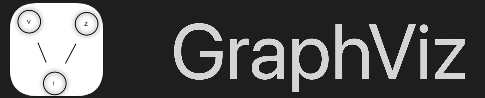
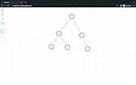
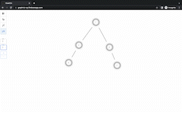
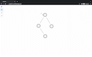
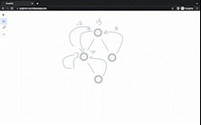
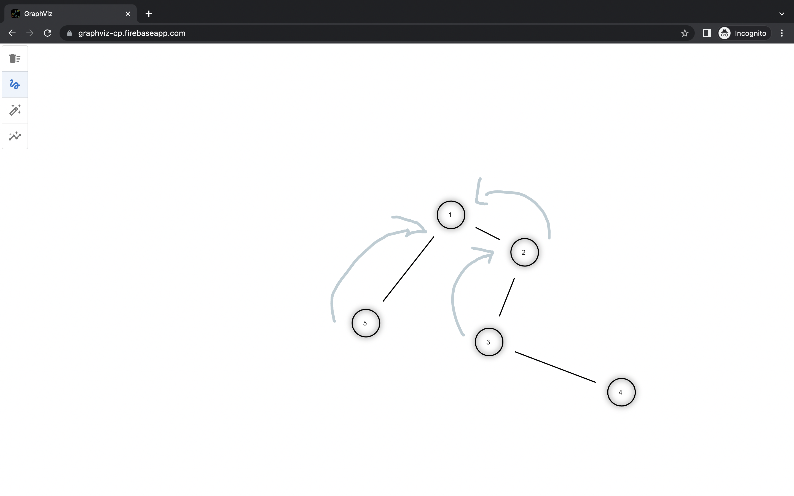

# Project Title

This project aims to give a visualizer tool for understanding Graph Algorithms.

## Features

- Graph creation and custom node and edge deletion
- Draggable nodes and edges
- Custom node labels
- Free drawing and erasing
- One click clear canvas functionality

## Demo

|  |  |  | 

## Screenshots



## Tech Stack

**Client:** React, Redux, ConvaJS

## Run Locally

Clone the project

```bash
  git clone https://link-to-project
```

Go to the project directory

```bash
  cd my-project
```

Install dependencies

```bash
  npm install
```

Start the server

```bash
  npm run start
```

## 🚀 About Me

I'm a full stack developer...

## License

[MIT](https://github.com/cd-x/graphviz/blob/master/LICENSE)

## Badges

[](https://github.com/cd-x/graphviz/blob/master/LICENSE)
